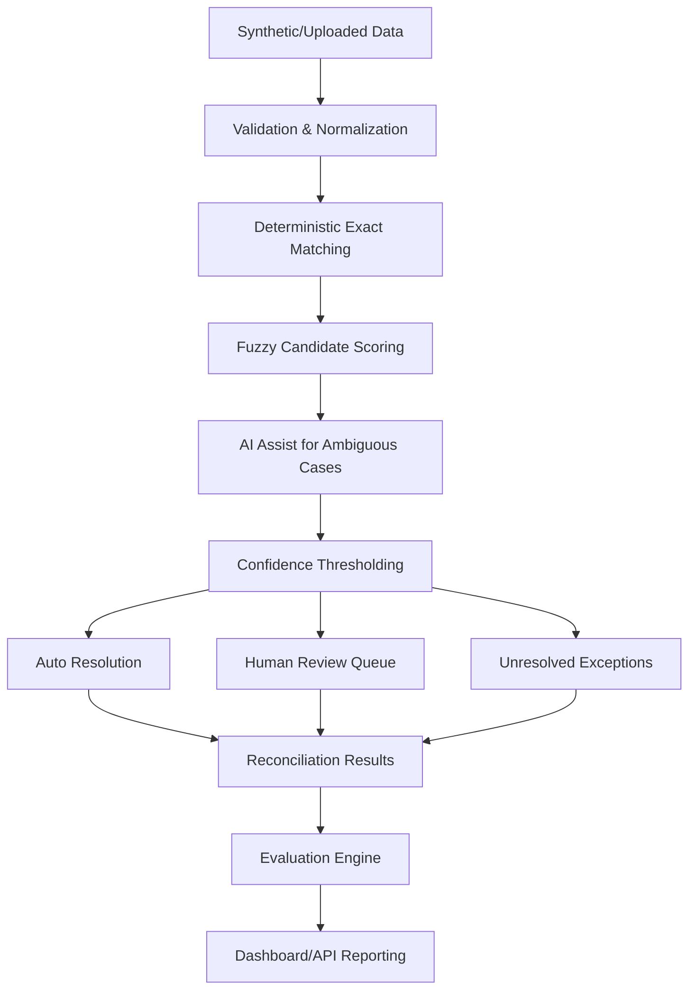

# AI Finance Controller

Production-style prototype for **automated multi-source financial reconciliation and exception management**.

## What this project does

AI Finance Controller processes transactions from:

1. Bank statements
2. Internal accounting ledger
3. Payment/settlement records

It reconciles records using deterministic + fuzzy + AI-assisted logic, then outputs:

- Matched / AI-matched / review / unresolved decisions
- Exception queue with recommended actions
- Confidence scores and evidence
- Reproducible quality metrics (precision, recall, F1)
- Throughput and processing-time metrics
- Human review actions and audit trail

## Why this matters

Finance reconciliation is often manual, slow, and error-prone. Teams need automation for high-confidence cases while preserving clear visibility into ambiguous and risky records.

This prototype is intentionally designed to **avoid fake 100% matching** and surface unresolved exceptions honestly.

## Architecture



## Tech stack

- **Next.js App Router** + TypeScript
- **PostgreSQL** + **Drizzle ORM**
- Tailwind CSS
- Deterministic LLM-provider abstraction fallback (`LLMProvider`)

## Dataset generation

`src/lib/finance/generator.ts` creates synthetic batches (default: 150 transactions) with realistic scenarios:

- Exact matches
- Description variations
- Amount mismatches
- Date differences
- Missing records (bank/ledger/payment)
- Duplicates
- Partial payments
- Unexpected fee scenarios
- Currency mismatches
- Ambiguous candidates

Each transaction group has ground truth:

- `expected_status`
- `expected_exception_type`
- `scenario`

## Reconciliation strategy

1. **Exact matching**: strong identifiers + amount + currency + date consistency
2. **Normalization**: aliases, punctuation cleanup, legal suffix stripping, reference normalization
3. **Fuzzy scoring** using weighted signals:
   - Description similarity
   - Amount similarity
   - Date proximity
   - Reference similarity
   - Currency/type consistency
4. **AI-assisted evaluation** only for medium-confidence ambiguous cases
5. **Thresholding**:
   - High `>= 0.90` auto resolve
   - Medium `0.70–0.89` review/AI path
   - Low `< 0.70` unresolved

## API endpoints

- `POST /api/data/generate`
- `POST /api/reconciliation/run`
- `GET /api/reconciliation/summary`
- `GET /api/transactions`
- `GET /api/transactions/{id}`
- `GET /api/exceptions`
- `GET /api/exceptions/{id}`
- `POST /api/exceptions/{id}/resolve`
- `GET /api/evaluation`
- `GET /api/health`

## Dashboard capabilities

- One-click **Run Demo Dataset**
- CSV upload for bank / ledger / payment files
- KPI cards (processed records, match rate, exceptions, timing)
- Reconciliation status distribution
- Transaction-level table with confidence and reasons
- Exception dashboard with filters and human actions
- Transaction detail panel with explainability trail

## Metrics computed from real output

- Match rate
- Precision
- Recall
- F1
- False positives / false negatives
- Exception detection accuracy
- Auto-resolution rate
- Human-review rate
- Rule vs AI processing time
- Throughput (records/sec)

## Run locally

1. Install dependencies:

```bash
npm install
```

2. Configure env:

```bash
cp .env.example .env
# edit DATABASE_URL if needed
```

3. Apply schema:

```bash
npx drizzle-kit push
```

4. Start app:

```bash
npm run dev
```

5. Open dashboard and click **Run Demo Dataset**.

## Testing

Sample tests are included for:

- Normalization
- Scoring
- End-to-end batch reconciliation output

Test files are in `tests/`.

## Security & privacy notes

- Uses synthetic data only
- Masked account numbers
- Secrets are environment-based
- No API keys hardcoded
- AI provider abstraction avoids sending unnecessary fields by default

## Limitations

- Current CSV parser is intentionally lightweight and assumes simple comma-separated data
- Deterministic AI fallback is heuristic and does not replace enterprise-grade model governance
- No role-based access control in this prototype
- Ground-truth evaluation is strongest in synthetic mode (upload mode has fallback assumptions)

## Product principle

The system prioritizes **honest exception handling** over inflated match rate. If confidence is insufficient, it marks the transaction for review or unresolved status.
